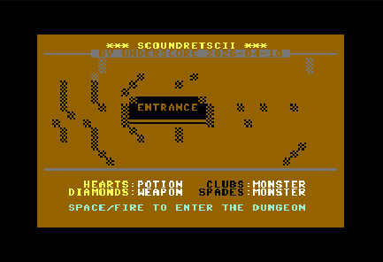

# [Play it now](https://goodo.nya.je/play/)

C64 BASIC PETSCII variant of the Scoundrel card game.

Joystick port 2 or keyboard controls (Gamepad works in the web version, touchscreens need to be vertical and not running the "Desktop" version to see the controls). Sound effects and start/victory music included.

In this variant Aces are worth 1 instead of 14, and all 52 cards are used without jokers, and all potions in a room can be used.

If you've never played Scoundrel here's a brief overview:

It's a solo roguelike where you begin with 20 hit points (HP) and encounter a series of dungeon rooms, and each room contains four cards. You must resolve three of the cards and the fourth card carries over to the next room. You have the option to flee the room (up arrow or joystick up) but cannot do that in consecutive rooms.

Roles of the card suits:

* Clubs and Spades: monsters.
* Hearts: healing potions.
* Diamonds: weapons.

Card values:

* Ace = 1
* Numbered cards = their face value
* Jack = 11
* Queen = 12
* King = 13

Controls: Left/right joystick or cursor keys to select a card, joystick button or space/return key to engage a monster or take a weapon/potion, joystick up or up cursor key to flee a room, joystick down or down cursor key to remove a potion or weapon with no effect, or to fight a monster bare-handed.

Gameplay:

Equip a weapon by taking it, which discards your previous weapon.

To remove a monster from a room you fight it either bare-handed (down, or button/space before you equip a weapon) or use a weapon (button/space if you have equipped one).

If you fight bare-handed the damage to your HP equals the value of the monster card, and if the value of the monster card is equal to or greater than your remaining HP then you die, GAME OVER, otherwise you've killed the monster.

Fighting a monster can be done with any value weapon if that weapon has not already killed a monster. In that instance if the value of your weapon is greater than that of the monster you will receive no damage, otherwise your damage is minimised by the value of your weapon

The value of your weapon degrades as you use it. It reduces to the value of the last monster you killed with it, and you are unable to use it against subsequent monsters of equal or greater value than it. You can still fight those monsters bare-handed.

Taking a potion increases your HP by the value of that card, but only up to your max HP of 20.

If you make it to the last room of the dungeon you need to remove all the cards in it to WIN.

Also available at:

* [itch](https://mardeg.itch.io/scoundretscii)
* [CSDB](https://csdb.dk/release/?id=260800)
* [imglink](https://imglink.cc/cdn/LnW4Fq9fim.svg)
* [iDev](https://idev.games/game/scoundretscii)
* [gamejolt](https://gamejolt.com/games/scoundretscii/1086865)
* [slagdock](https://slagdock.com/play/scoundretscii)
* [spreadmygame](https://www.spreadmygame.com/?p=games&g=385)
* [funinbrowser](https://www.funinbrowser.com/?g=385)
* [twelve](https://www.twelve.games/categories?platform=browser&genre=card&pricing=Free)
